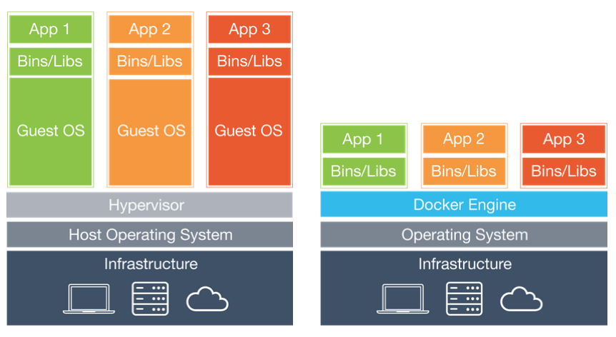

# Docker

## 도커란?

컨테이너 기반 가상화 플랫폼

도커를 보자마자 VM(가상머신)이 생각났는데 위 사진이 VM과 Docker의 차이이다.

각종 시스템 자원을 가상화하고 독립된 공간을 생성하는 작업은 Hypervisor를 반드시 거치기 때문에 일반 호스트에 비해 **성능의 손실**이 발생함.

VM은 Guest Os를 사용하기 위한 라이브러리, 커널 등을 전부 포함하기 때문에 이미지의 크기가 커짐.

#### 즉, VM은 완벽한 운영체제를 생성할 수 있다는 장점은 있지만 일반호스트에 비해 성능 손실이 있고, 수 기가바이트에 달하는 가상머신 이미지를 애플리케이션으로 배포하기는 부담스럽다는 단점을 가지고 있다.

VM과는 달리 도커는 컨테이너(가상화된 공간)을 생성하기 위해 리눅스 자체 기능인 chroot, namespace, cgroup을 사용함으로써 격리 환경을 만들기 때문에 성능 손실이 거의 없다.

컨테이너에 필요한 커널은 host의 커널을 공유해 사용하고, 컨테이너 안에는 필요한 라이브러리 및 실행 파일만 존재하기 때문에 이미지 용량또한 가상 머신에 비해 대폭 줄어듦.

## 도커 엔진

도커 엔진의 기본 단위 : 이미지와 컨테이너.

### 도커 이미지?

이미지는 컨테이너를 생성할 때 필요한 요소.

VM생성시 사용하는 iso파일과 비슷한 개념.

이미지는 여러 개의 계층으로 된 바이너리 파일로 존재

컨테이너를 생성하고 실행할 때 읽기 전용으로 사용.

### 도커 컨테이너

이미지로 컨테이너를 생성하면 해당 이미지의 목적에 맞는 파일이 들어 있는 파일시스템과 격리된 시스템 자원 및 네트워크를 사용할 수 있는 독립된 공간이 생성됨.

컨테이너에서 무엇을 하든지 원래 이미지는 영향을 받지 않는다.

각 컨테이너는 각기 독립된 파일시스템을 제공받으며 호스트와 분리돼 있으므로 특정 컨테이너에서 어떤 애플리케이션을 설치하거나 삭제해도 다른 컨테이너와 호스트는 변화가 없다.

# Kubernetes